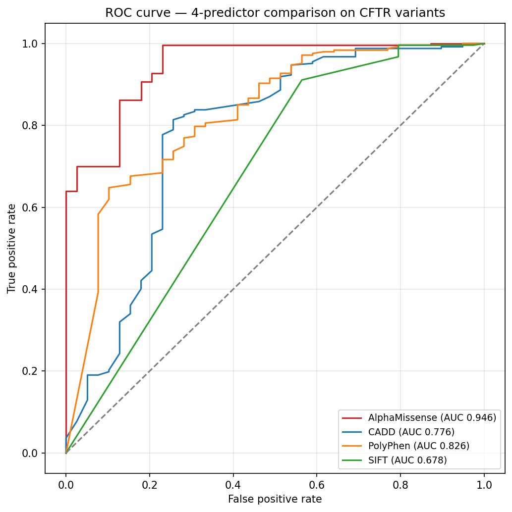
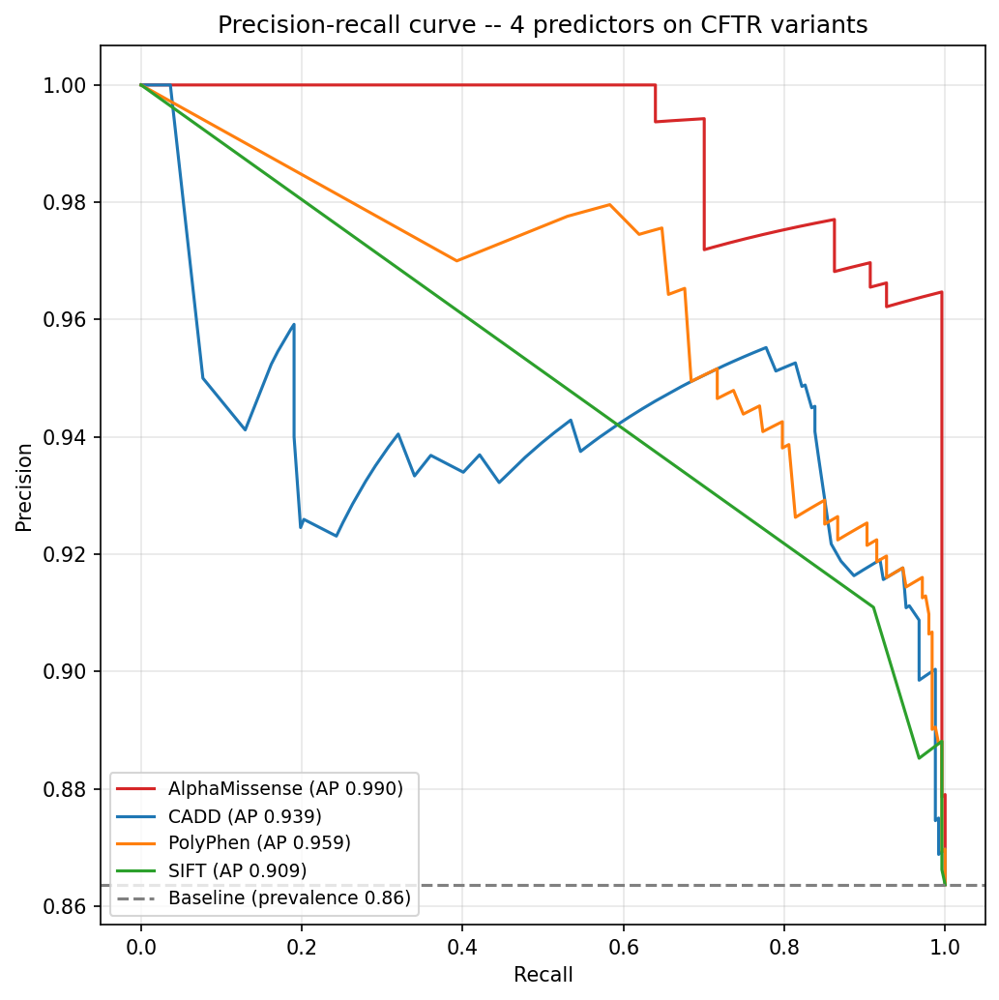
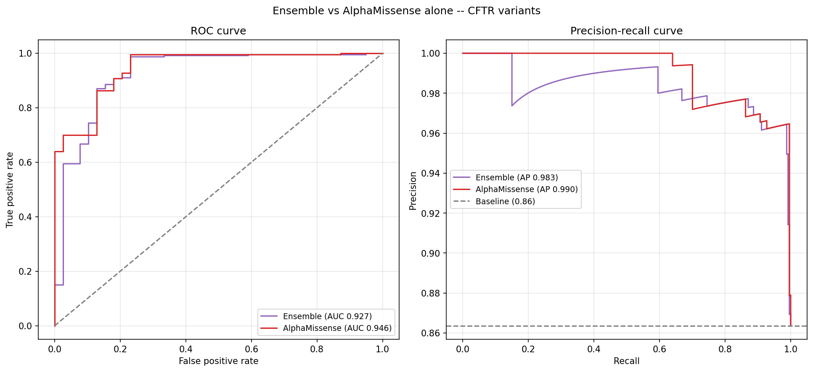
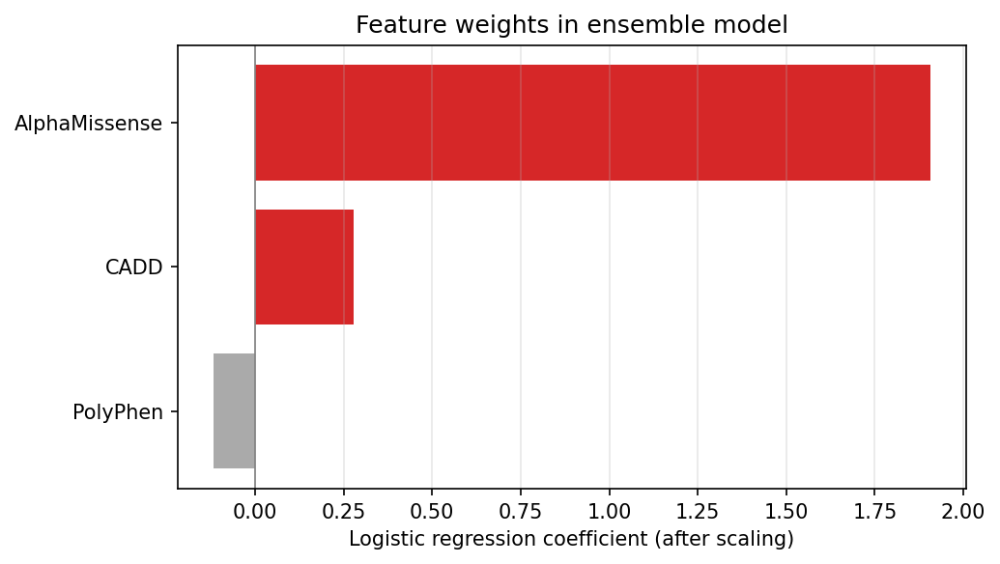
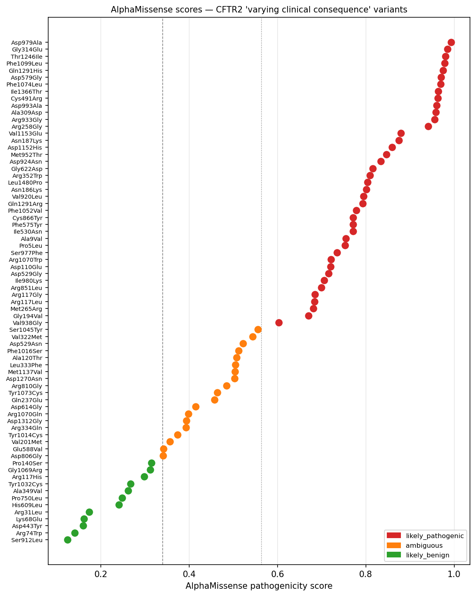
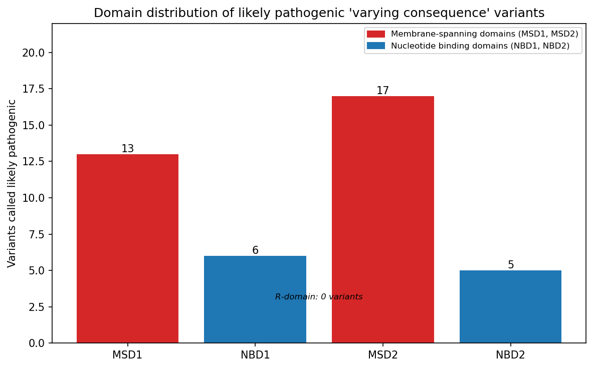

# AlphaMissense annotation for CFTR variants

## Why this exists

The CFTR2 pipeline matched 656 of 3,220 variants. 80% had no clinical classification.

CFTR2 only includes variants seen in enough patients to characterise. Most variants in a real VCF are rare. They exist in population databases but have never been studied at scale in CF patients. That is not a flaw. It is just the nature of rare variant data.

But it raises a question. What are those 2,564 variants?

AlphaMissense predicts pathogenicity for every possible human missense variant. It was built from protein structure and evolutionary data, not from CFTR2. That independence matters. If its predictions agree with CFTR2 on the variants we do have labels for, we can apply it to the ones we do not.

We checked that first. AUC 0.946 on 292 labelled CFTR variants. Good enough to use. We then ran it on the unclassified variants and found 705 predicted likely pathogenic with no clinical classification anywhere. We also looked at the 72 variants CFTR2 itself marks as uncertain. That turned out to be the most interesting part.

Requires `cftr2_results.csv` from `cftr2_scraper.ipynb`.

## What is AlphaMissense

AlphaMissense is a pathogenicity predictor from Google DeepMind. It assigns a score between 0 and 1 to every possible human missense variant. The scores are pre-computed and published as a downloadable dataset. No model needs to be run locally.

## What this does

1. Downloads the AlphaMissense hg38 dataset (~1.4 GB) and filters it to CFTR variants only (UniProt P13569)
2. Converts VCF variant names from three-letter amino acid format (`Ser13Phe`) to single-letter format (`S13F`) to match AlphaMissense convention
3. Merges scores into the CFTR2 results
4. Validates AlphaMissense predictions against CFTR2 ground truth
5. Flags unclassified variants predicted likely pathogenic
6. Cross-references flags with gnomAD population frequency from the VCF
7. Analyses the "varying clinical consequence" group

## Results

### Validation

| Metric | Value |
|---|---|
| Variants used | 292 |
| AUC | 0.946 |
| Accuracy | 0.94 |
| CF-causing F1 | 0.96 |
| Non CF-causing F1 | 0.77 |

AlphaMissense agrees with CFTR2 clinical classifications at AUC 0.946. The weaker F1 on Non CF-causing is expected. Only 39 such variants were available.

Note on class imbalance: 253 CF-causing vs 39 Non CF-causing. The overall accuracy is partly inflated by this. The AUC is the more reliable metric here.

### Comparison against CADD, PolyPhen, and SIFT

We benchmarked AlphaMissense against three predictors on 286 variants with all four scores available. CADD scores were fetched via the REST API. SIFT and PolyPhen were extracted from the CSQ field of the VCF.

| Predictor | AUC |
|---|---|
| AlphaMissense | 0.946 |
| PolyPhen | 0.826 |
| CADD | 0.776 |
| SIFT | 0.678 |

AlphaMissense outperforms every baseline on both metrics. PolyPhen is second. SIFT is weakest.

| Predictor | AUC (ROC) | Average Precision (PR) |
|---|---|---|
| AlphaMissense | 0.946 | 0.990 |
| PolyPhen | 0.826 | 0.959 |
| CADD | 0.776 | 0.939 |
| SIFT | 0.678 | 0.909 |

The PR curve is the more informative metric here. The validation set is 253 CF-causing vs 39 Non CF-causing -- ROC is optimistic on imbalanced data. On PR, AlphaMissense leads by 3 points over PolyPhen and maintains clean precision across the full recall range. CADD's curve is jagged at low recall -- it makes confident wrong calls at high score thresholds.

CADD and PolyPhen are gene-agnostic. SIFT uses sequence conservation but no structural context. AlphaMissense draws on protein language model representations trained on evolutionary data across the full proteome. On a well-studied gene with a known 3D structure, that depth of representation is the advantage.





### Ensemble model

We tested whether combining AlphaMissense, CADD, and PolyPhen in a logistic regression would outperform AlphaMissense alone. Stratified 5-fold cross-validation on 286 variants.

| Model | AUC | AP |
|---|---|---|
| AlphaMissense alone | 0.946 | 0.990 |
| Ensemble (AM + CADD + PolyPhen) | 0.927 | 0.983 |

The ensemble is worse. Feature weights after scaling: AlphaMissense +1.907, CADD +0.279, PolyPhen -0.117. The model learns to ignore CADD and discount PolyPhen. AlphaMissense already captures what they offer. Adding them introduces noise.





### Unclassified variants

Of the 2,564 variants not in CFTR2, 2,411 had AlphaMissense scores.

| AlphaMissense class | Count |
|---|---|
| likely_benign | 1,349 |
| likely_pathogenic | 705 |
| ambiguous | 357 |

Of the 705 flagged, only 7 had gnomAD population frequency data in the VCF. Those are the highest-priority candidates: predicted pathogenic, observed in the general population, never classified by CFTR2.

We cross-referenced all 7 against ClinVar. Every one of them is unresolved.

| Variant | AM score | Population AF | ClinVar |
|---|---|---|---|
| Leu49Pro | 0.976 | 0.0002 | Uncertain significance |
| His1054Gln | 0.901 | 0.0002 | Uncertain significance |
| Leu986Pro | 0.869 | 0.0004 | Conflicting classifications |
| Pro355Leu | 0.858 | 0.0002 | Uncertain significance |
| Phe650Leu | 0.846 | 0.0002 | Uncertain significance |
| Arg104Gly | 0.845 | 0.0002 | Uncertain significance |
| Arg1097Cys | 0.651 | 0.0002 | Conflicting classifications |

5 are classified as uncertain significance. 2 have conflicting classifications, meaning different labs have actively disagreed. AlphaMissense calls all 7 likely pathogenic.

Leu986Pro and Arg1097Cys are the strongest candidates. Clinical disagreement already exists on both. AlphaMissense provides consistent computational evidence for pathogenicity. Arg1097Cys was last evaluated in ClinVar in February 2026.

These 7 variants are not in CFTR2, are observed in the general population, have no clinical consensus, and score high on a model validated at AUC 0.946 on this gene. They are candidates for functional follow-up.

The remaining 539 flagged variants are too rare to appear in gnomAD. They may be family-private mutations or sequencing artifacts.

### Varying clinical consequence

72 variants in CFTR2 are marked as "varying clinical consequence". CFTR2 has insufficient data to classify them cleanly. AlphaMissense scored all 72.

| AlphaMissense class | Count |
|---|---|
| likely_pathogenic | 41 |
| ambiguous | 19 |
| likely_benign | 12 |

41 of 72 are called likely pathogenic. CFTR2 is uncertain about them. The model is not. Asp979Ala scores 0.993 while CFTR2 still classifies it as varying. These are direct reclassification candidates.

Arg117His scores 0.299 (likely benign). This is consistent with clinical knowledge. R117H is associated with mild phenotypes and CBAVD rather than classic CF. That agreement is a meaningful sanity check on the model.



The plot shows clear separation between classes. The ambiguous variants sit near the thresholds as expected. Val938Gly at ~0.6 is a borderline call worth noting.

**Domain mapping of the 41 likely pathogenic variants:**

| Domain | Variants |
|---|---|
| MSD1 | 13 |
| NBD1 | 6 |
| R-domain | 0 |
| MSD2 | 17 |
| NBD2 | 5 |

73% cluster in the membrane-spanning domains. These form the chloride channel pore. Mutations there directly disrupt ion conductance. The R-domain has zero — it is intrinsically disordered and more tolerant of missense variation. The domain distribution is not random. It reflects where structural disruption matters most.



### Nonsense variants

311 variants could not be matched to AlphaMissense because they are nonsense mutations, not missense. AlphaMissense does not score stop codons. These were excluded from the main analysis but not ignored.

232 of 311 matched CFTR2. 225 are CF-causing, as expected. Premature stop codons truncate the protein and almost always cause disease.

Two are classified as varying clinical consequence: Ser1455Ter and Gln1476Ter. Both sit near the C-terminus of a 1,480 amino acid protein. Ser1455Ter truncates the last 25 residues, Gln1476Ter truncates only the last 4. That minimal truncation explains the clinical uncertainty.

89 nonsense variants have no CFTR2 classification. They are novel stop codons not seen in enough patients to characterise.

## Limitations

- Class imbalance in the validation set. 253 CF-causing vs 39 Non CF-causing. Results should be interpreted with that in mind.
- 311 VCF variants could not be converted to single-letter format. These are likely non-missense variants (frameshifts, nonsense) and were excluded from AlphaMissense matching.
- Population frequency data was only available for 117 of 3,220 variants. Most are too rare for gnomAD.
- AlphaMissense does not model compound heterozygosity, splicing effects, or regulatory context.

## Files

| File | Description |
|---|---|
| `alphamissense.ipynb` | Experiment notebook |
| `AlphaMissense_hg38.tsv.gz` | Full AlphaMissense dataset. Not committed, ~1.4 GB. |
| `cftr_alphamissense.tsv` | CFTR-filtered scores. Not committed. |
| `cftr2_results_annotated.csv` | All variants with CFTR2 and AlphaMissense annotations. Not committed. |
| `flagged_unclassified.csv` | 705 unclassified variants predicted likely pathogenic. Not committed. |
| `priority_candidates.csv` | 7 high-priority variants with population frequency. Not committed. |
| `varying_consequence_am.csv` | 72 varying consequence variants with AlphaMissense scores. Not committed. |
| `comparison.ipynb` | 4-predictor benchmark notebook (AlphaMissense, CADD, PolyPhen, SIFT) |
| `ensemble.ipynb` | Ensemble model notebook |
| `roc_comparison.png` | AlphaMissense vs CADD ROC curve |
| `roc_4way.png` | 4-predictor ROC curve comparison |
| `pr_4way.png` | 4-predictor precision-recall curve comparison |
| `ensemble_vs_am.png` | Ensemble vs AlphaMissense ROC and PR curves |
| `ensemble_weights.png` | Logistic regression feature weights |

## Dependencies

```
pandas
requests
scikit-learn
matplotlib
```
